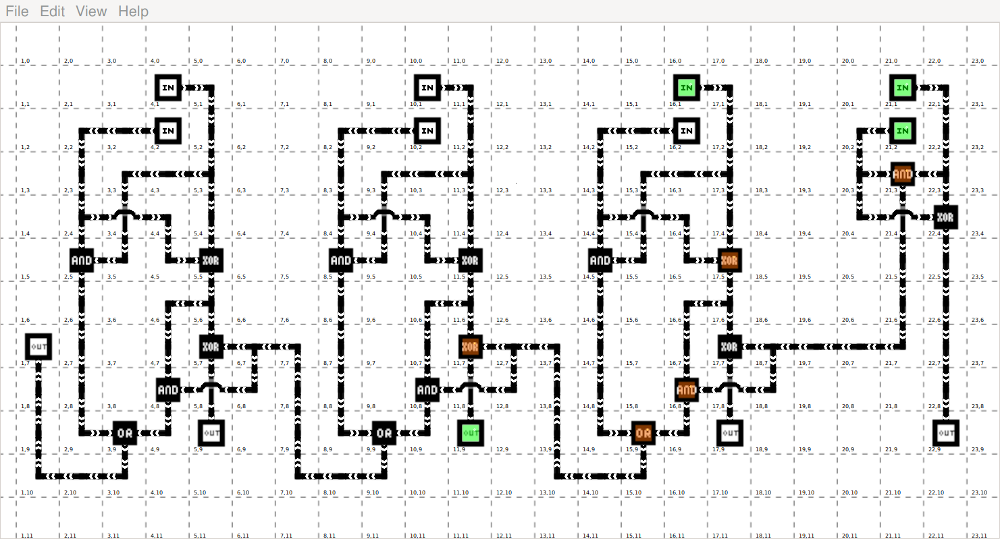

cLogicToy
=========

 3+1=4

a simple toy for grid based logic circuits

click on any cell to edit it, 
right click on an input cell to toggle it on or off

there are a small number of example circuits that can be loaded
including a 4 bit adder !

currently saving isn't implemented (will be very soon!)

I'd welcome and thoughts or suggestions...
